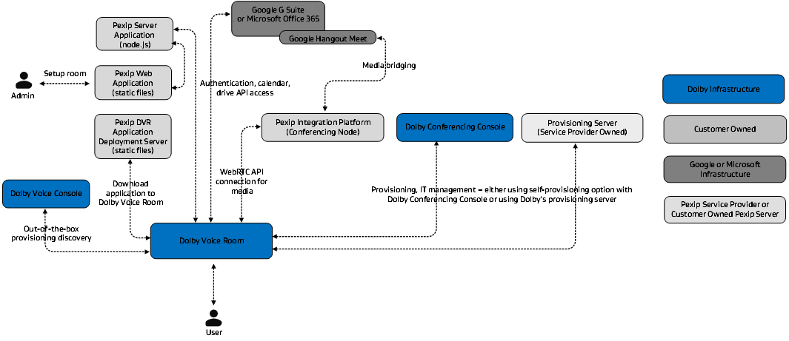
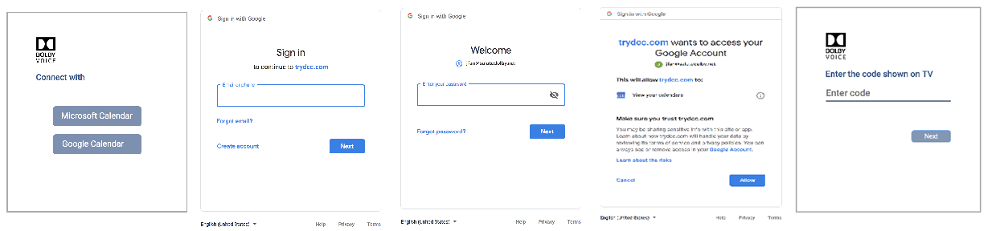
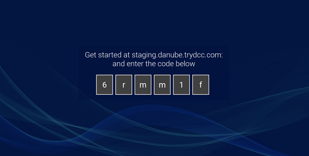
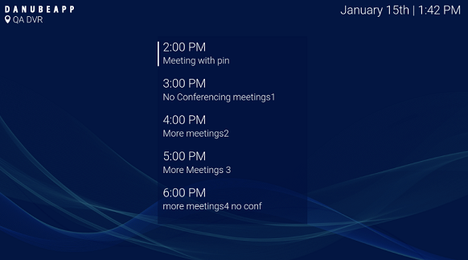
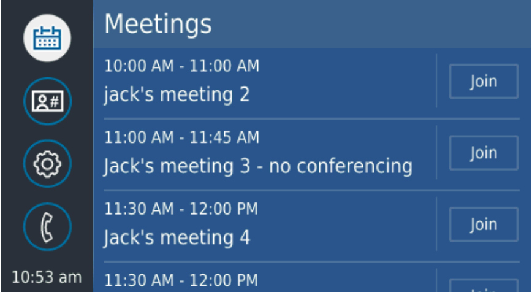

# Introduction

Dolby Voice Room application for Pexip Infinity, is an open source project initiated by Dolby Laboratories.

The application consists of these components:

-   A node.js based server that can be deployed in the cloud to perform authentication proxy and device setup assistance.
-   A desktop web application customers use to authenticate themselves and pair Dolby Voice Room with the customer account.
-   A Dolby Voice Room application, including both the Dolby Voice Hub and the Dolby Conference Phone, that runs on the system, providing full conference room experience to the user.



## Desktop web application

The desktop web application is created to streamline the setup experience, enabling non-technical users to set up the system.

The desktop web application workflow is shown in this graphic:



-   The user connects all required interfaces and powers on the Dolby Voice Room system.
-   the Dolby Voice Room system shows a six character activation code, along with a URL indicating how to reach to the desktop web application.
-   The user navigates to the desktop web application and authenticates with either Microsoft Office 365 or Google.
-   The user enters the six character activation code. The Dolby Voice Room application now has the authentication token to communicate with Google or Microsoft to automatically download calendar information. Events in the calendar are presented on the TV as well as on theDolby Conference Phone, allowing the user to enjoy the one touch join experience.

## Dolby Voice Room application

The Dolby Voice Room application consists of two components:

-   Dolby Voice Hub application
-   Dolby Conference Phone application

The two components communicate with each other to implement the user interface.

The Dolby Voice Room application operates in two modes - out-of-the-box setup mode and normal operation mode.

In the out-of-the-box setup mode, the Dolby Voice Room system awaits user activation. The user must access the desktop web application to activate the system.

In normal operation mode, the Dolby Voice Room system has been activated against an enterprise account, allowing the user to interact with the system for meeting.


|      | Out-of-the-box setup mode | Normal operation mode |
| ---- | ------------------------- | --------------------- |
| Dolby Voice Hub application |  |  |
| Dolby Conference Phone application |  |  |


# Development workflow

## Development prerequisites

Before you start developing the application, you should complete these requirements:

-   Familiarize yourself with the Pexip Infinity product offering and you should have installed your own Pexip Conference Node instance.You need to obtain software licenses from Pexip Infinity. For more information on installing Pexip, see this page: [https://docs.pexip.com/admin/site\_installation.htm](https://docs.pexip.com/admin/site_installation.htm).
-   Have a basic knowledge about how to develop applications for the Dolby Voice Room. The Dolby Voice Hub application is a standard Web application, which uses the Pexip JavaScript API to interact with the Pexip conferencing node. On the Dolby Conference Phone side, there is a Qt/Qml application that requires digital signing for security purposes. For more information about the Pexit JavaScript API, see [https://docs.pexip.com/api\_client/api\_pexrtc.htm](https://docs.pexip.com/api_client/api_pexrtc.htm). For more informaiton on digital signing, see [https://developer.dolby.com/technology/dolby-voice/dcpsdk/sign-the-app/](https://developer.dolby.com/technology/dolby-voice/dcpsdk/sign-the-app/) For an overview on Dolby Voice Room application development and API references, see this page: [https://developer.dolby.com/technology/dolby-voice/dvr/dvhsdk/manual/index/](https://developer.dolby.com/technology/dolby-voice/dvr/dvhsdk/manual/index/).
-   Have a general understanding of cloud-based application development and deployment.
-   Know how to obtain site certificates and understand how SSL/TLS works.
-   Have a general understanding of Google Calendar API and Office 365 Calendar API, node.js server application development, and React.JS framework. For more information on Google Calendar API and Office 365 Calendar API, see [https://developers.google.com/calendar/v3/reference/](https://developers.google.com/calendar/v3/reference/) and [https://docs.microsoft.com/en-us/previous-versions/office/office-365-api/api/version-2.0/calendar-rest-operations](https://docs.microsoft.com/en-us/previous-versions/office/office-365-api/api/version-2.0/calendar-rest-operations). For more information on node.js and React.JS, see [https://nodejs.org/en/](https://nodejs.org/en/) and [https://reactjs.org/](https://reactjs.org/).
-   Obtain Google OAuth 2.0 Client ID and secret, as well as Microsoft Office 365 client ID and secret for the app you are going to be developing and deploying. For more information see [https://developers.google.com/identity/protocols/OAuth2](https://developers.google.com/identity/protocols/OAuth2) and [https://docs.microsoft.com/en-us/azure/active-directory/develop/v2-oauth2-client-creds-grant-flow](https://docs.microsoft.com/en-us/azure/active-directory/develop/v2-oauth2-client-creds-grant-flow).
-   Have a general understanding of WebRTC and WebAudio APIs. For more information, see [https://webrtc.org/](https://webrtc.org/) and [https://developer.mozilla.org/en-US/docs/Web/API/Web\_Audio\_API](https://developer.mozilla.org/en-US/docs/Web/API/Web_Audio_API).
-   Make sure your Pexip Infinity instance is on software version R20 or later. If you want to use HDMI input for content sharing, we recommend running version R21 \(not yet released\).
-   Google Chrome 31.0.x or later for Dolby Voice Room WebRTC.

## Trying the sample deployment

For your convenience, Dolby maintains a sample deployment.

You can configure your Dolby Voice Room to connect to this sample deployment using the instructions in this section.

**Note:** The sample deployment only demonstrates the functionality of the Dolby Voice Room application for Pexip Infinity. It is not meant to be a service that is actively maintained by Dolby. Do not use this sample deployment for end customer facing production services. Dolby is not responsible for any problems that may arise if this sample deployment was used for any sort of production service. Dolby may, at its discretion, shutdown the service for maintenance or other purposes, without any prior notice.

### Using the Dolby provisioning server

This is the easiest way to configure your Dolby Voice Room to the sample deployment.

Dolby controls configuration and Dolby Voice Room system software running on your device.

1.  Log in to the Dolby Voice Room web user interface.
2.  Go to **Settings** \> **Provisioning** \> **Server** and configure the field as `danube.trydcc.com`.
3.  Go to **Settings** \> **Provisioning** \> **Type** and configure the field as HTTPS.

Your Dolby Voice Room may be updated after the provisioning is completed.

### Using self-configuration

If you want to modify the Dolby Voice Room configuration after trying the sample deployment, this is the recommended method.

The self-configuration approach allows you to control individual configuration parameters that define the Dolby Voice Room behavior, which in this case, runs the Dolby Voice Room application for Pexip Infinity.

-   Follow the instructions to learn how to configure the Dolby Voice Room to load the right application: [https://developer.dolby.com/technology/dolby-voice/dvr/dvhsdk/manual/set-up-gear-and-load-demo-app/](https://developer.dolby.com/technology/dolby-voice/dvr/dvhsdk/manual/set-up-gear-and-load-demo-app/)
-   Configure `Dvms.Hub.AppUrl` as [https://danube.trydcc.com](https://danube.trydcc.com/)
-   Configure `Phone.App.Url` as [http://danube.trydcc.com/dcpapp](http://danube.trydcc.com/dcpapp)
-   Download the CA certificate and root CA certificate, and import the certificates to the Dolby Voice Room through the web user interface:
    -   [https://letsencrypt.org/certs/lets-encrypt-x3-cross-signed.pem.txt](https://letsencrypt.org/certs/lets-encrypt-x3-cross-signed.pem.txt)
    -   [https://confluence.dolby.net/kb/download/attachments/330238960/IGCSRVCA1toFBCA2016\_0.pem?version=1&modificationDate=1550904601373&api=v2](https://confluence.dolby.net/kb/download/attachments/330238960/IGCSRVCA1toFBCA2016_0.pem?version=1&modificationDate=1550904601373&api=v2)

### Configuring the application to connect to your own Pexip Infinity instance

Once you have your Pexip Infinity instance set up, you can configure the Dolby Voice Room to connect to your Pexip Infinity instance.

Ensure that you have completed all preparations and requirements, keeping in mind that all Dolby Voice Room systems must connect to a provisioning server outside the firewall.

1.  Log in to the Dolby Voice Room web user interface. For instrutions see: [https://developer.dolby.com/technology/dolby-voice/dvr/dvhsdk/manual/set-up-gear-and-load-demo-app/](https://developer.dolby.com/technology/dolby-voice/dvr/dvhsdk/manual/set-up-gear-and-load-demo-app/)

2.  Go to **Settings** \> **Dolby Voice Conferencing Service** \> **Custom** \> **Custom Parameter 1**.

3.  Configure the field with this JSON string:

    Sample configuration for customization

    ```
    {
        "pexipNode": "https://your-pexip-node-url",
        "appBackground": "https://gdurl.com/F5_r",
        "appLogo": "https://gdurl.com/Ra_D"
    }
    ```

    -   Where the `pexipNode` field points to your Pexip Infinity instance.
    -   The optional `appBackground` is a URL pointing to an image file for the custom background image that will be used to replace the default wallpaper.
    -   The optional `appLogo` is a URL pointing to an image file for the service provider logo, in order to replace the default logo.

## Setting up the development environment

This section describes how to set the developer environment for the Pexip Infinity instance for the Dolby Voice Room.

The procedures described were tested on MacOS Mojave 10.14 and Ubuntu 18.04 LTS.

The easiest way to start the application is using Docker. However, it can be run directly on the developer machine.

### Using Docker

The Dolby Voice Room application for Pexip Infinity consists of three containers:

-   For the Dolby Conference Phone application - nginx based containers, mapping port 80 to host port 80.
-   For the server application - node:8 based containers, mapping ports 11443 and 3443 to host ports 11443 and 3443 for API and web sockets.
-   For the webapp - node:8 based containers, mapping ports 1234 and 12345 to host ports 1234 and 12345 for parcel. For information on parcel, see: [https://parceljs.org/](https://parceljs.org/).

### Docker prerequisites

These requirements must be met prior to using Docker.

1.  Install Docker for desktop. \([https://docs.docker.com/docker-for-mac/](https://docs.docker.com/docker-for-mac/)\)
2.  Install Docker Compose. \([https://docs.docker.com/compose/install/](https://docs.docker.com/compose/install/)\)
3.  Download the source code and place into the project root folder.

### Working with the application

1.  Start the stack:

    ```
    docker-compose -f
              ./docker-compose-dev.yml up -d --force-recreate --build
    ```

2.  Shut down the stack:

    ```
    docker-compose -f
              ./docker-compose-dev.yml down
    ```

3.  List the containers:

    `docker ps`

4.  Restart the container:

    ```
    docker restart
            danube_webapp
    ```

5.  View logs:

    ```
    docker
              logs -f danube_server
    ```


### **Configuring Dolby Voice Room to load the application**

You can configure Dolby Voice Room to load the application.

1.  Obtain a self-signed certificate for your development environment.

    You need to create a self-signed certificate for your Docker instances and use a self-assigned DNS name as in [dev.serviceprovider.com](http://dev.serviceprovider.com/). You can customize the host files to let Dolby Voice Room resolve the name and connect to your development service. The easiest way to create a self-signed certificate is to use a command-line openssl utility and run following command:

    `openssl req -x509 -nodes -newkey rsa:2048 -keyout key.pem -out cert.pem -days 365`

    Most of the information you are prompted for is not relevant for local development purposes, but when prompted for **Common Name**, enter the self-assigned DNS name of the development instance \([dev.serviceprovider.com](http://dev.serviceprovider.com/)\). Two generated files, key.pem and cert.pem, should be used in nginx and server application configuration. The cert.pem file should also be included in the Dolby Voice Room configuration so it will trust the host with this certificate.

2.  Customize the hosts file on Dolby Voice Room.

    Once Dolby Voice Room is enabled with the devtools, you can modify the system hosts file using CLI commands.

    Instructions for creating custom hosts entry on Dolby Voice Room:

    ```
    DolbyCli>system poweruser hosts
    
      add             Add hosts record.
      remove          Remove host record from /etc/hosts.
      reset           Reset /etc/hosts overrides.
      show            Show /etc/hosts
    ```

3.  Configure Dolby Voice Room

    Configure the Dolby Voice Hub application as [https://<your\_local\_IP\>:1234](https://localhost:1234/), and the Dolby Conference Phone application as `http://<your_local_IP>/`. For instructions, see: [https://developer.dolby.com/technology/dolby-voice/dvr/dvhsdk/manual/set-up-gear-and-load-demo-app/](https://developer.dolby.com/technology/dolby-voice/dvr/dvhsdk/manual/set-up-gear-and-load-demo-app/). You can use [https://localhost:1234](https://localhost:1234/) on your desktop browser to access the setup page.


# Deployment workflow

This section describes a basic deployment process for the Dolby Voice Room application for Pexip Infinity. Dolby recommends using Ubuntu 18.04 LTS \(AMI id ami-0ac019f4fcb7cb7e6\) for the deployment in AWS.

## Deployment prerequisites

Before you deploy the application, you should complete these requirements:

-   EC2 instance

    For experimental deployment, a t2.small instance is sufficient. When creating an instance please ensure that the incoming TCP ports 80, 443 and 3443 are open in the security group configuration for everyone, and port 22 is open for trusted networks/locations.

-   System setup

    The Dolby Voice Room application for Pexip Infinity uses node.js. The application was tested with node.js version 8 from nodesource repo. To install the environment run following commands:

    ```
    curl -sSL https://deb.nodesource.com/gpgkey/nodesource.gpg.key | sudo apt-key add -
    echo 'deb https://deb.nodesource.com/node_8.x xenial main' | sudo tee /etc/apt/sources.list.d/nodesource.list
    sudo apt update
    sudo apt install nodejs
    ```

    The build process also requires that the parcel-bundler package is installed globally:

    ```
    sudo npm install -g parcel-bundler@1.11.0
    ```

    The application itself consists of three components:

    -   The Dolby Conference Phone application, built and packaged by Dolby.
    -   The web application \(for both desktop browser and Dolby Voice Room\). When built, it is a set of static web files \(HTML, JavaScript, images, fonts\) that is served by the server.
    -   The server application. Acts as a web server and serves static content like the web application, the Dolby Conference Phone application, and handles authentication request on behalf of the Dolby Voice Room.
    For security purposes, it is recommended \(but not required\) that you create a dedicated user to run the application.

    ```
    sudo useradd -d /opt/danube -m danube
    sudo passwd -l danube
    ```

    The web application and WebRTC signalling use TLS communication, so developers need to create a private key/certificate pair. The same pair can be used for both parts of the server. It is up to the developer on how to create it; either OpenSSL or Let'sEncrypt tools can be used, but they need to make sure that \(a\) a private key is not passphrase-protected, so the software can load it and \(b\) both key and certificate files are accessible by the application user.


## Building components

Use these steps to build the components.

1.  Deploy the Dolby Conference Phone application to `<server_dir>/public/dcpapp/app`.

    When copied, there must be a `<server_dir>/public/dcpapp/app/.app.cfg` file.

    The .app.cfg file is the manifest file of the Dolby Conference Phone application and is the root file the Dolby Conference Phone downloads when it tries to load the application.

2.  When the web application is built, it takes some parameters, such as Google or Microsoft auth IDs/secrets in the form of environment variables. Create the shell file danube-env.sh using this content to manage the environment variables:

    ```
    APP_HOSTNAME=danube.myproject.com
    APP_NAME='danube'
    DB_NAME='PDAPP'
    PROTOO_HOST="${APP_HOSTNAME}"
    PROTOO_PORT=3443
    WEBAPP_HOST="${APP_HOSTNAME}"
    WEBAPP_PORT=11443
    NODE_ENV='development'
    DEBUG='*,-babel,-stylus:*,-snapdragon:*'
    ```

3.  Build the web application using this script:

    ```
    cd webapp
    source /path/to/danube-env.sh
    npm install
    npm run build
    ```

    This should produce the dist folder with multiple files.

4.  Copy the files to server's application public folder:

    ```
    cp -fR dist/* /opt/danube/server/public/
    sudo chown -R danube:danube /opt/danube
    ```

5.  Install the server application requirements \(as an application user\):

    ```
    sudo -u danube -i
    cd /opt/danube/server/
    npm install
    exit
    ```

    Similar to the web application, the server application takes certain parameters during the build and requires them for a run-time configuration

6.  Create a /opt/danube/env file with content similar to this:

    ```
    APP_NAME=danube-server
    WEBRTC_DOMAIN='danube.myproject.com'
    WEBRTC_CERTIFICATE='/etc/letsencrypt/archive/danube.myproject.com/fullchain1.pem'
    WEBRTC_KEY='/etc/letsencrypt/archive/danube.myproject.com/privkey1.pem'
    WEBAPP_PORT=11443
    PROTOO_PORT=3443
    GOOGLE_CLIENT_ID=''
    GOOGLE_CLIENT_SECRET=''
    GOOGLE_CLIENT_REDIRECT_TO='https://danube.myproject.com/gsuite-connect'
    MICROSOFT_CLIENT_ID=''
    MICROSOFT_CLIENT_SECRET=''
    MICROSOFT_CLIENT_REDIRECT_TO="https://${APP_HOSTNAME}/ms-connect"
    MICROSOFT_SCOPE='offline_access https://graph.microsoft.com/.default'
    ```

7.  Create a systemd unit file \(/lib/systemd/system/danube.service\) to manage automatic application start-up:

    ```
    [Unit]
    Description=Pexip for Dolby Voice Room Server App
    Documentation=
    After=network.target
    
    [Service]
    Type=simple
    User=danube
    WorkingDirectory=/opt/danube/server/
    ExecStart=/usr/bin/nodejs server.js
    Restart=on-failure
    EnvironmentFile=-/opt/danube/env
    
    [Install]
    WantedBy=multi-user.target
    ```

8.  Enable and start the service:

    ```
    sudo systemctl daemon-reload
    sudo systemctl enable danube
    sudo systemctl start danube
    ```

    At this point server application should be running and listening on ports 11443 and 3443.

9.  Check the server application status:

    ```
    ubuntu@ip-172:~$ systemctl status danube
    ● danube.service - Danube app
       Loaded: loaded (/lib/systemd/system/danube.service; enabled; vendor preset: enabled)
       Active: active (running) since Wed 2019-02-13 11:42:17 UTC; 5min ago
     Main PID: 772 (Danube-server)
        Tasks: 6 (limit: 2362)
       CGroup: /system.slice/danube.service
               └─772 Danube-server
    
    Feb 13 11:42:19 ip-172 nodejs[772]: Wed, 13 Feb 2019 11:42:19 GMT express:router:route get '/app-version'
    Feb 13 11:42:19 ip-172 nodejs[772]: Wed, 13 Feb 2019 11:42:19 GMT express:router:layer new '/'
    Feb 13 11:42:19 ip-172 nodejs[772]: Wed, 13 Feb 2019 11:42:19 GMT express:router use '/dcpapp' serveStatic
    Feb 13 11:42:19 ip-172 nodejs[772]: Wed, 13 Feb 2019 11:42:19 GMT express:router:layer new '/dcpapp'
    Feb 13 11:42:19 ip-172 nodejs[772]: Wed, 13 Feb 2019 11:42:19 GMT express:router use '/' serveStatic
    Feb 13 11:42:19 ip-172 nodejs[772]: Wed, 13 Feb 2019 11:42:19 GMT express:router:layer new '/'
    Feb 13 11:42:19 ip-172 nodejs[772]: Wed, 13 Feb 2019 11:42:19 GMT express:router use '/' <anonymous>
    Feb 13 11:42:19 ip-172 nodejs[772]: Wed, 13 Feb 2019 11:42:19 GMT express:router:layer new '/'
    Feb 13 11:42:19 ip-172 nodejs[772]: 2019-02-13T11:42:19.680Z Server:INFO Danube web app listening on port 11443
    Feb 13 11:42:19 ip-172 nodejs[772]: 2019-02-13T11:42:19.680Z Server:INFO protoo WebSocket server running 3443 0.0.0.0
    ```


## Setting up NGINX

NGINX is used as a reverse proxy for server application to solve several problems, such as serve Dolby Conference Phone application over HTTP \(it is signed, so it is safe to use HTTP\) and redirect other URLs to HTTPS, or serve content from the server on standard HTTPS port 443.

1.  Install NGINX on the new server:

    ```
    sudo apt install NGINX
    ```

2.  Create a new server configuration `/etc/nginx/sites-available/danube`:

    ```
    server {
      listen 80;
      listen [::]:80;
      server_name  danube.myproject.com;
    
      location ^~ /dcpapp/ {
        alias /opt/danube/server/public/dcpapp/app/;
      }
    
      location / {
        return 301 https://$host$request_uri;
      }
    }
    
    server {
      listen       443 ssl;
      server_name  danube.myproject.com;
    
      ssl_certificate /etc/letsencrypt/live/danube.myproject.com/fullchain.pem;
      ssl_certificate_key /etc/letsencrypt/live/danube.myproject.com/privkey.pem;
    
      location / {
        proxy_pass https://localhost:11443;
        proxy_http_version 1.1;
        proxy_set_header Upgrade $http_upgrade;
        proxy_set_header Connection 'upgrade';
        proxy_set_header Host $host;
        proxy_cache_bypass $http_upgrade;
        proxy_pass_request_headers on;
      }
    }
    ```

3.  Enable the new site and reload the NGINX configuration:

    ```
    cd /etc/nginx/sites-enabled/
    sudo ln -s ../sites-available/danube
    sudo nginx -s reload
    ```

# Copyright

© 2019 Dolby Laboratories. All rights reserved.

**Dolby Laboratories, Inc.**  
         1275 Market Street  
         San Francisco, CA 94103-1410 USA  
         Telephone 415-558-0200  
         Fax 415-645-4000  
         [http://www.dolby.com](http://www.dolby.com)  
         

# Trademarks

 Dolby and the double-D symbol are registered trademarks of Dolby Laboratories.

The following are trademarks of Dolby Laboratories:

-   Dialogue Intelligence™
-   Dolby®
-   Dolby Advanced Audio™
-   Dolby Atmos®
-   Dolby Audio™
-   Dolby Cinema™
-   Dolby Digital Plus™
-   Dolby Digital Plus Advanced Audio™
-   Dolby Digital Plus Home Theater™
-   Dolby Home Theater®
-   Dolby Theatre®
-   Dolby Vision™
-   Dolby Voice®
-   Feel Every Dimension™
-   Feel Every Dimension in Dolby™
-   Feel Every Dimension in Dolby Atmos™
-   MLP Lossless™
-   Pro Logic®
-   Surround EX™

All other trademarks remain the property of their respective owners.

# Patents

THIS PRODUCT MAY BE PROTECTED BY PATENTS AND PENDING PATENT APPLICATIONS IN THE UNITED STATES AND ELSEWHERE. FOR MORE INFORMATION, INCLUDING A SPECIFIC LIST OF PATENTS PROTECTING THIS PRODUCT, PLEASE VISIT [http://www.dolby.com/patents](http://www.dolby.com/patents).

